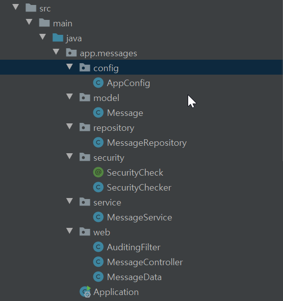

메세지 앱 (기본 게시판 CURD)
-
* 도메인 구조
* 설정
* 프론트엔드 구조

---

도메인 구조 
-

* config : 설정 파일 
   - => ([AppConfig.java](src/main/java/app/messages/config/AppConfig.java))
   - 필터
   - DB 세션 
   - 트랜잭션 관리
   
* model : DB 테이블과 매핑을 맺을 엔티티 
   - => ([Message.java](src/main/java/app/messages/model/Message.java))
   - Entity 명시
   - 테이블 명시
   - 필드 설정 (setter 대신 getter와 생성자만 제공)
   
* repository : 엔티티를 사용해서 DB와 매핑을 맺어줌 
   - => ([MessageRepository.java](src/main/java/app/messages/repository/MessageRepository.java))
   - select
   - insert
   - update
   - delete
   
* security : aop 를 통한 보안과 관련 메소드 정의, 해당 역할을 하는 어노테이션 생성 
   - => ([SecurityChecker.java](src/main/java/app/messages/security/SecurityChecker.java))
   - 포인트컷
   - 조인포인트
   - 어노테이션
   
* anotation : 어노테이션 생성 (security 폴더 내부에 있음) 
   - => ([SecurityCheck.java](src/main/java/app/messages/security/SecurityCheck.java))
   - @Target
   - @Retention
   
* service : 비지니스 로직. 여기서 트랜잭션 처리  
   - => ([MessageService.java](src/main/java/app/messages/service/MessageService.java))
   - @Transactional
   - @Security
* web : 컨트롤러 작동에 직접적으로 관련이 있는 클래스 들이 위치. 예를 들면 필터를 적용해주는 것은 "설정"이라는 항목과 관련이 있지 컨트롤러와는 관련이 없다. 반면 필터 자체는 컨트롤러에 요청이 오기 전에 꼭 거쳐야 하는 곳이므로 논리적으로 연관이 있다. 그래서 필터와 컨트롤러는 같은 곳에 둔다. 또한 엔티티 클래스(DB 커넥션과 관련)가 아닌 컨트롤러가 받아야 할 데이터 자체는 컨트롤러와 관련이 있으므로 컨트롤러와 같이 둔다.
   - 필터 : doFilter 
      - => ([AuditingFilter.java](src/main/java/app/messages/web/AuditingFilter.java))
   - 데이터 클래스 : 오직 컨트롤러에 들어오는 데이터를 받기 위함. @RequestBody 어노테이션과 관련이 있음 
      - => ([MessageData.java](src/main/java/app/messages/web/MessageData.java))
   - 컨트롤러 : 
      - => ([MessageController.java](src/main/java/app/messages/web/MessageController.java))
       1. @Controller
       2. @*Mapping
       3. @ResponseBody
       4. @RequestBody => ResponseEntity와 관련이 있음 (기본제공)
       
* Application : 스프링부트 시작하기

---
설정
-
* application.properties : prefix, suffix 나 datasource, spring.jpa.open-in-view 설정, SQL DEBUG 설정, DEBUG 설정 등등이 가능 ([application.properties](src/main/resources/application.properties "application.properties"))

---
프론트 엔드
-
* components : 부품별로 관리
    - 메세지 리스트 - ([MessageList.js](src/main/resources/static/components/MessageList.js))
    - 메세지 아이템 리스트 - ([MessageListItem.js](src/main/resources/static/components/MessageListItem.js))  
* directives : 지시자들 관리
    - ([focus.directive.js](src/main/resources/static/directives/focus.directive.js))  
* filters : 값을 필터해줌. 자바로 치면 일종의 함수 개념
    - ([datetime.filter.js](src/main/resources/static/filters/datetime.filter.js))  
* mixins : 값을 복제해서 사용할 대상
    - ([datetime.filter.js](src/main/resources/static/mixins/lifecycle-logger.mixin.js))  
* plugins : 모든 뷰 인스턴스가 공통적으로 가지게 할 플러그인들
    - ([lifecycle-logger.plugin.js](src/main/resources/static/plugins/lifecycle-logger.plugin.js))  
* 대상 모듈(화면) 파일 : 
    -  ([index.mustache](src/main/resources/templates/index.mustache))  
